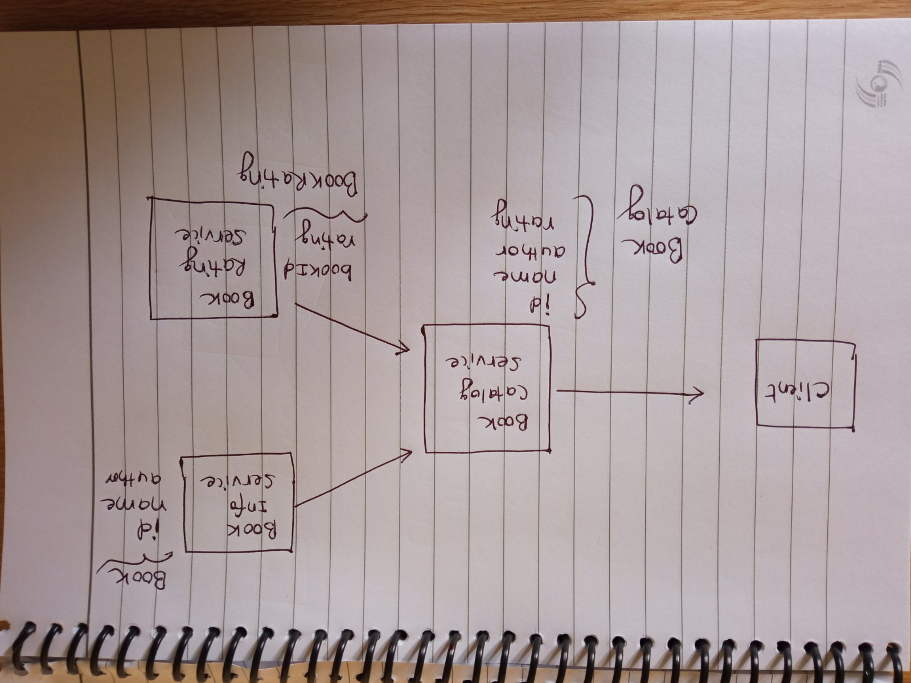

### Book Store

This project will eventually adopt microservice architecutre.

The three services :

1. book-info-service : 
   - Deals with Book Information ( id, name , author)
   
2. book-rating-service :
   - Deals with Book Rating ( bookId, rating)
   
3. book-catalog-service:
   - Deals with Book Catalog(id, name, author, rating)
   - Communicate with book-info-service and book-rating service to 
    achieve its functions.

### Architecture ( without service discovery pattern)

